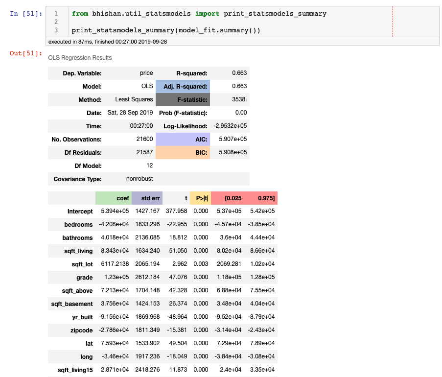
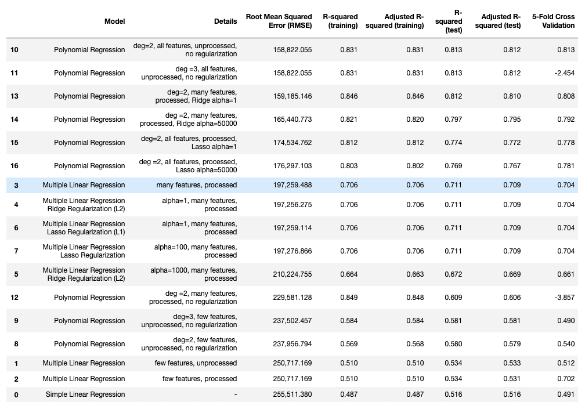
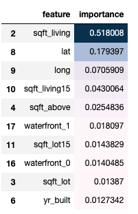
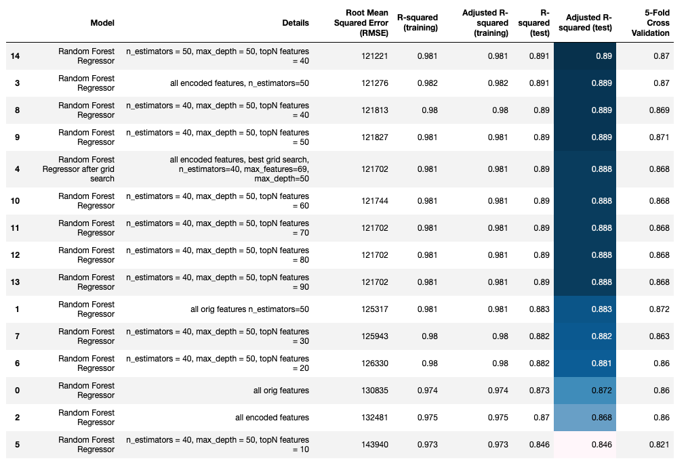
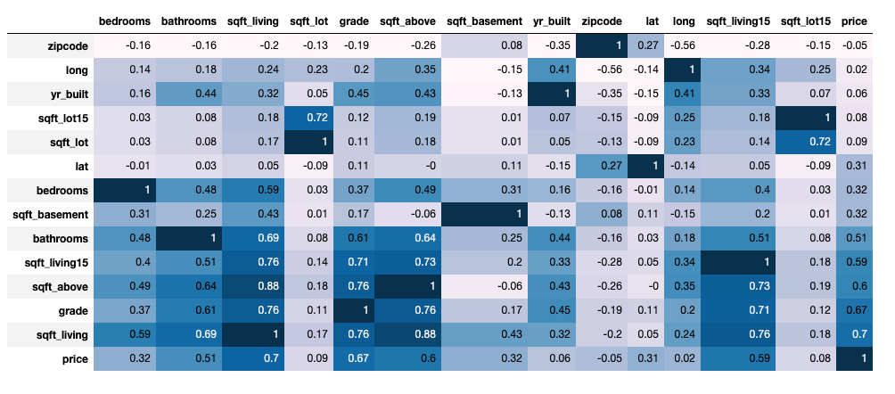
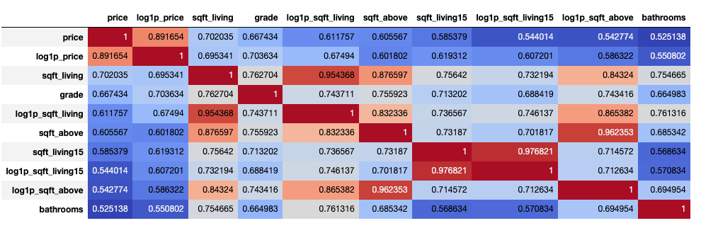
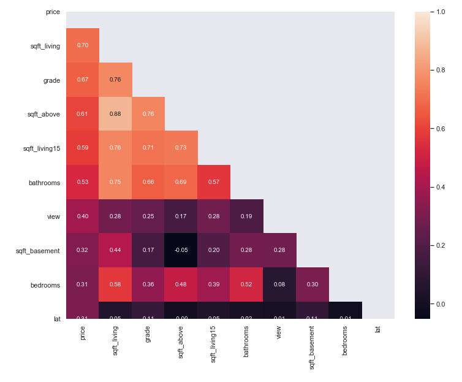
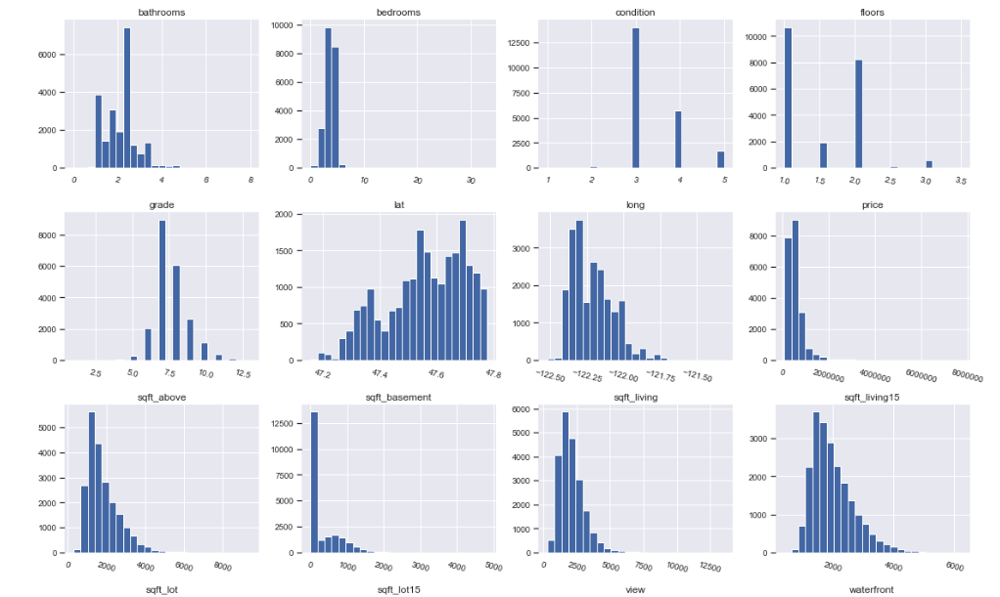
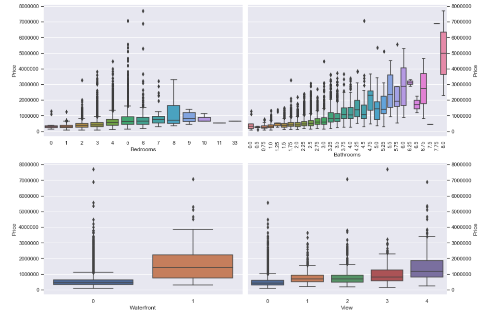
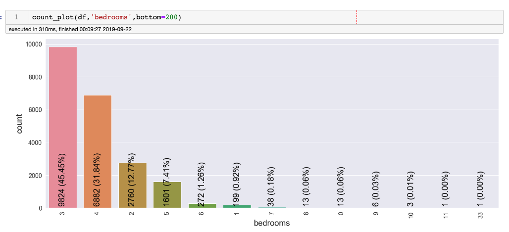

# Project: King County House Price Prediction

# Project Structure
- Raw input dataset is at `data/raw/kc_house_data.csv`
- `notebooks` directory has all the notebooks for exploratory data analysis,
   visualization, modelling and model interpretation.
- The project is divided into multiple parts:
  + Data processing: `notebooks/a01_regression_data_processing.ipynb`
  + Data visualization: `notebooks/b01_regression_data_visualization_and_eda.ipynb`
  + Data profiling: `notebooks/b04_regression_data_visualization_and_eda_with_pandas_profiling.ipynb`
  + Simplest model: linear regression `notebooks/c01_regression_modelling_linear_and_polynomial_sklearn.ipynb`
  + Linear regression using statsmodels `notebooks/c02_regression_modelling_linear_ols_statsmodels.ipynb`
  + Try all regression methods using sklearn to find best model: `notebooks/c03_regression_modelling_sklearn_methods.ipynb`
  + Best model found random forest grid searched feature importance selected: `notebooks/c05_regression_modelling_random_forest_feature_importance.ipynb`
  + I found Random Forest gives the best result for this data: `notebooks/c07_regression_modelling_final_model_random_forest_scripts.ipynb`


# Data Description

This dataset contains house sale prices for King County, which includes Seattle.
It includes homes sold between May 2014 and May 2015.

- Dependent features: 1 (price)
- Features : 19 home features
- Id:  House ID

Task: Try to estimate the price of house based on given features.


# Step 1: Data Cleaning and Feature Engineering
- notebook:  `notebooks/a01_regression_data_processing.ipynb`
- script:  `src/data/data_cleaning.py`

In this house price dataset we have no missing values and some numerical features and
some categorical features.

Tree based algorithms such as Decision Tree and Random Forest, may not require
much feature engineering but linear models and svm benifits from creating new features
and doing feature engineering.

Here, we have `date` as date feature, we can create `yr_sales` feature using
this feature and then create another feature age of house using `yr_sales` 
and `yr_built`. I also noted that some of the houses have negative age of -1,
this means some houses are sold before they were even built.

I also crated a new feature `age_after_renovation` using `yr_sales` and
`yr_renovated` features.

Some of the features are categorical features. I checked the unique numbers of
all the categorical features and found that `zipcode` has 70 unique classes.
Encoding `zipcode` to 70 features may give the overfitted result and I created only
ten encoded features taking top10 zipcode corrosponding to the most expensive houses.
Note that it is one of the possible options and we could have chosen other number of
classes and used another method of selection of top features such as most frequent zipcodes or something else.

I also created a new feature `zipcode_houses` which gives number of houses in each
zipcode. Now I have only 10 proxy zipcode encoded values but I also have new feature
which uses all zipcode information and gives number of houses in each zipcode location.

Two new boolean features are also created, which gives whether there is a basement in the house or not and whether the house is renovated or not.

The coninuous numerical features `age` and `age_after_renovation` we taken and
and new binned categorical features were created from them. Again, the number of 
bins is choice of hyperparameter and I chose 10 bins for each of them.

Now we have `waterfront`, `view`, `condition`, `grade`,  `zipcode_top10`,
`age_cat`, `age_after_renovation_cat` as the categorical features, and I encoded
them using `pandas get_dummies` and remvoed the first dummy variable to avoid
trap of dummy variable.


When we look at the dataframe, some of the features have particularly large
values such as `price`, `sqft_living`, `sqft_lot`, `sqft_above`,
`sqft_basement`, `sqft_living15`, `sqft_lot15`. I did a `log 1 +x ` transformation
on them so that all the features have now more or less similar range. This makes
the gradient process faster and also may improve the model predictions.

In the end, I dropped the unwanted feature like `id` and saved all these
processed features to a datafile for future use.

Note that, I have not done feature scaling (standard scaling or robust scaling),
which I will do at the time of modelling not here at the time of data processing.
Also, I have not removed outliers (using IQR or simply obvious outliers), which
again can be treated at the time of modelling.

# Step 2: Data visualization and EDA
Afer rigorous data processing and feature engineering, I did some
 exploratory data analysis (EDA) using `seaborn` and `pandas`. To get the interactive
 plots I used `plotly` module which uses `D3.js` and gives nice interactive plots
 instead of static plots such as `matplotlib` and `seaborn`.

 I also used IBM module `pixiedust` to do data visualization. This is pretty nice
 plotting tool which can utilize plotting backends like `matplotlib` or `seaborn`
 or `bokeh` to show the figures in more of a GUI like fashion.

 Some simple statistics and feature analysis were also done using `pandas_profiling`
 library. This gives number of counts, missing values, zero counts and correlation
 plots between all the variables. This is particularly useful when the dataset is small.
 Since our dataset is not particularly huge, I utitlized this awesome library and obtained some of the statistical analysis using just one or two lines of code.

# Step 3: Try all possible models to get the best result
Machine learning is not a one shot problem, not only one the so called `best`
model works for all the data. We need to use multiple algorithms and figure out
their performances.

Since this is a regression problem, I started with simple linear regression model.
There are multiple modules to do the linear regression, or this is a very basic
model which I can code in few minutes and test the result myself. However, I used
two most popular libraries `sklearn` and `statsmodels` to do the linear regression.
Using statsmodel I got the r-squared value of 0.663.


At first, I chose the `sqft_living` as the most important featrue and did regression
against the house price. This gives Adjusted R-squared (test data) 0.516 which is too low,
and we can utilize all other raw features and also the newly created features.

I checked the performance of multiple linear regression and polynomial regression with 
various types of features. I found following result:


After doing linear regression, I tested different algorithms such as decision trees,
naive bayes, svm, and random forest.

Random forest regressor gave the best result. Then I tuned the hypter parameters
using grid search and also did feature importance filtering to get the most
relevant features for the analysis. The top 10 most important features are shown
below:



 I tried different number of top number of features and  found out that  40 top features were important and got the best result for adjusted r-squared value of test data 0.89.


Notebooks are great for explorations, and we need scripts for daily job data
analysis projects. So, I created a final version of script for data modelling and 
saved it in `models/regression_modelling_final_random_forest.py`.

Result:
```
Author: Bhishan Poudel

Task
-------------------
Regression modelling of King Country Seattle house price estimation.

Model used
-------------------------
Random forest 
n_estimators = 50
max_depth = 50
topN features = 40

Result:
---------------------------
Adjusted R-Squared (test): 0.890
```

# Boosting Models
The bagging model Random forest after extensive hyperparameter search gave me adjusted r-squared score for test data 0.890.

I also explored boosting method and after grid search I got following result:


| Boosting Model | Test Adjusted R-squared | Description |
| :---| :--- | ---: |
| Catboost | 0.914417 | Tuned|
| Lightgbm | 0.9112 | Grid search: Random Search|
| Xgboost | 0.9111 | sequential grid search |
| Lightgbm | 0.9091 | Grid search: hyperopt|
| GradientBoostingRegressor | 0.90816  | Default  |
| Catboost | 0.90059 | Using eval_set|
| Lightgbm | 0.89179  | Default |


# Big data modelling
sklearn and pandas are great only when the dataset is small (few thousands), they
can not handle millions of rows and often time in real world data can be much much
larger than thousands of rows and can be multiple millions, in that case we need to
scale up our data analysis pipeline. I chose one the popular library called `pyspark`
and redid all the analysis. In fact spark is a scala package and `pyspark` is just
a python wrapper around scala and javascripts codes. This library (version 2.0) supports
dataframe based syntax similar to pandas and makes doing data analysis much easier than
previous (version 1.0) rdd like syntax. Also, in `pyspark` the module `mllib` is
based on RDD syntax and hence deprecated. So, I used only `pyspark.ml` library and 
did all the anlysis (data cleaning, feature engineering, modelling, grid search,
 feature importance and model evaluation) were done using `pyspark.ml`. The notebook for this is `d01_regression_modelling_using_pyspark.ipynb`.

 # Some of the EDA results






