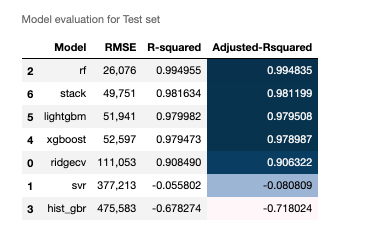

<h1 style="background-color:tomato;">Project Description</h1>

In this project, the dataset contains house sale prices for King County, which includes Seattle. It includes homes sold between May 2014 and May 2015. There are 19 house features and one dependent feature `price`. The aim of the project is to estimate the house price.

<h1 style="background-color:tomato;">Data processing</h1>

- Linear models and svm benefits from scaling (and removing outliers), I did normalizing and robust scaling.
- Created a new feature `age_after_renovation` using `yr_sales` and `yr_renovated` features.
- `zipcode` has too many unique values, reduced it to 70 values.
- Created a new feature called `zipcode_houses` which gives number of houses in each zipcode.
- Created binned features from `age` and `age_after_renovation`.
- Did `log1p` transformation of continuous numerical features.

<h1 style="background-color:tomato;">Best Results</h1>
I tried various scikit learn algorithms including stacking and blending. The random forest gave me the best `Adjusted R-squared Value`.

<h1 style="background-color:tomato;">Big data modelling</h1>

- `scikit-learn` and `pandas` can not deal with large data (`>1GB`). To scale up the project, I used big data platform `PySpark`.
- `spark` is a scala package and `pyspark` is the a python wrapper around it.
- In `pyspark`, `mllib` is deprecated, so, I used only `pyspark.ml`.
- I used `Random Forest` in pyspark and tuned the hyper parameters to get the best Adjusted R-squared value.

<h1 style="background-color:tomato;">Some of the EDA results</h1>

<h1 style="background-color:tomato;">Project Notebooks</h1>

|  Notebook | Rendered   | Description  |  Author |
|---|---|---|---|
| a01_regression_data_processing.ipynb  | [ipynb](https://github.com/bhishanpdl/Project_House_Price_Prediction/blob/master/notebooks/a01_regression_data_processing.ipynb), [rendered](https://nbviewer.jupyter.org/github/bhishanpdl/Project_House_Price_Prediction/blob/master/notebooks/a01_regression_data_processing.ipynb)  |   | [Bhishan Poudel](https://bhishanpdl.github.io/)  |
| a02_regression_data_processing_script.ipynb  | [ipynb](https://github.com/bhishanpdl/Project_House_Price_Prediction/blob/master/notebooks/a02_regression_data_processing_script.ipynb), [rendered](https://nbviewer.jupyter.org/github/bhishanpdl/Project_House_Price_Prediction/blob/master/notebooks/a02_regression_data_processing_script.ipynb)  |   | [Bhishan Poudel](https://bhishanpdl.github.io/)  |
| a03_regression_statistics.ipynb  | [ipynb](https://github.com/bhishanpdl/Project_House_Price_Prediction/blob/master/notebooks/a03_regression_statistics.ipynb), [rendered](https://nbviewer.jupyter.org/github/bhishanpdl/Project_House_Price_Prediction/blob/master/notebooks/a03_regression_statistics.ipynb)  |   | [Bhishan Poudel](https://bhishanpdl.github.io/)  |
| b01_regression_data_visualization_and_eda.ipynb  | [ipynb](https://github.com/bhishanpdl/Project_House_Price_Prediction/blob/master/notebooks/b01_regression_data_visualization_and_eda.ipynb), [rendered](https://nbviewer.jupyter.org/github/bhishanpdl/Project_House_Price_Prediction/blob/master/notebooks/b01_regression_data_visualization_and_eda.ipynb)  |   | [Bhishan Poudel](https://bhishanpdl.github.io/)  |
| b02_regression_data_visualization_and_eda_bokeh.ipynb  | [ipynb](https://github.com/bhishanpdl/Project_House_Price_Prediction/blob/master/notebooks/b02_regression_data_visualization_and_eda_bokeh.ipynb), [rendered](https://nbviewer.jupyter.org/github/bhishanpdl/Project_House_Price_Prediction/blob/master/notebooks/b02_regression_data_visualization_and_eda_bokeh.ipynb)  |   | [Bhishan Poudel](https://bhishanpdl.github.io/)  |
| b03_regression_data_visualization_and_eda_plotly.ipynb  | [ipynb](https://github.com/bhishanpdl/Project_House_Price_Prediction/blob/master/notebooks/b03_regression_data_visualization_and_eda_plotly.ipynb), [rendered](https://nbviewer.jupyter.org/github/bhishanpdl/Project_House_Price_Prediction/blob/master/notebooks/b03_regression_data_visualization_and_eda_plotly.ipynb)  |   | [Bhishan Poudel](https://bhishanpdl.github.io/)  |
| b04_regression_data_visualization_and_eda_pixiedust.ipynb  | [ipynb](https://github.com/bhishanpdl/Project_House_Price_Prediction/blob/master/notebooks/b04_regression_data_visualization_and_eda_pixiedust.ipynb), [rendered](https://nbviewer.jupyter.org/github/bhishanpdl/Project_House_Price_Prediction/blob/master/notebooks/b04_regression_data_visualization_and_eda_pixiedust.ipynb)  |   | [Bhishan Poudel](https://bhishanpdl.github.io/)  |
| b05_regression_data_visualization_and_eda_with_pandas_profiling.ipynb  | [ipynb](https://github.com/bhishanpdl/Project_House_Price_Prediction/blob/master/notebooks/b05_regression_data_visualization_and_eda_with_pandas_profiling.ipynb), [rendered](https://nbviewer.jupyter.org/github/bhishanpdl/Project_House_Price_Prediction/blob/master/notebooks/b05_regression_data_visualization_and_eda_with_pandas_profiling.ipynb)  |   | [Bhishan Poudel](https://bhishanpdl.github.io/)  |
| c01_regression_modelling_linear_and_polynomial_sklearn.ipynb  | [ipynb](https://github.com/bhishanpdl/Project_House_Price_Prediction/blob/master/notebooks/c01_regression_modelling_linear_and_polynomial_sklearn.ipynb), [rendered](https://nbviewer.jupyter.org/github/bhishanpdl/Project_House_Price_Prediction/blob/master/notebooks/c01_regression_modelling_linear_and_polynomial_sklearn.ipynb)  |   | [Bhishan Poudel](https://bhishanpdl.github.io/)  |
| c02_regression_modelling_linear_ols_statsmodels.ipynb  | [ipynb](https://github.com/bhishanpdl/Project_House_Price_Prediction/blob/master/notebooks/c02_regression_modelling_linear_ols_statsmodels.ipynb), [rendered](https://nbviewer.jupyter.org/github/bhishanpdl/Project_House_Price_Prediction/blob/master/notebooks/c02_regression_modelling_linear_ols_statsmodels.ipynb)  |   | [Bhishan Poudel](https://bhishanpdl.github.io/)  |
| c03_regression_modelling_sklearn_methods.ipynb  | [ipynb](https://github.com/bhishanpdl/Project_House_Price_Prediction/blob/master/notebooks/c03_regression_modelling_sklearn_methods.ipynb), [rendered](https://nbviewer.jupyter.org/github/bhishanpdl/Project_House_Price_Prediction/blob/master/notebooks/c03_regression_modelling_sklearn_methods.ipynb)  |   | [Bhishan Poudel](https://bhishanpdl.github.io/)  |
| c04_regression_modelling_random_forest.ipynb  | [ipynb](https://github.com/bhishanpdl/Project_House_Price_Prediction/blob/master/notebooks/c04_regression_modelling_random_forest.ipynb), [rendered](https://nbviewer.jupyter.org/github/bhishanpdl/Project_House_Price_Prediction/blob/master/notebooks/c04_regression_modelling_random_forest.ipynb)  |   | [Bhishan Poudel](https://bhishanpdl.github.io/)  |
| c05_regression_modelling_random_forest_feature_importance.ipynb  | [ipynb](https://github.com/bhishanpdl/Project_House_Price_Prediction/blob/master/notebooks/c05_regression_modelling_random_forest_feature_importance.ipynb), [rendered](https://nbviewer.jupyter.org/github/bhishanpdl/Project_House_Price_Prediction/blob/master/notebooks/c05_regression_modelling_random_forest_feature_importance.ipynb)  |   | [Bhishan Poudel](https://bhishanpdl.github.io/)  |
| c06_regression_modelling_sklearn_best_r2.ipynb  | [ipynb](https://github.com/bhishanpdl/Project_House_Price_Prediction/blob/master/notebooks/c06_regression_modelling_sklearn_best_r2.ipynb), [rendered](https://nbviewer.jupyter.org/github/bhishanpdl/Project_House_Price_Prediction/blob/master/notebooks/c06_regression_modelling_sklearn_best_r2.ipynb)  |   | [Bhishan Poudel](https://bhishanpdl.github.io/)  |
| c07_regression_modelling_select_kbest.ipynb  | [ipynb](https://github.com/bhishanpdl/Project_House_Price_Prediction/blob/master/notebooks/c07_regression_modelling_select_kbest.ipynb), [rendered](https://nbviewer.jupyter.org/github/bhishanpdl/Project_House_Price_Prediction/blob/master/notebooks/c07_regression_modelling_select_kbest.ipynb)  |   | [Bhishan Poudel](https://bhishanpdl.github.io/)  |
| c08_regression_modelling_sklearn_gbr.ipynb  | [ipynb](https://github.com/bhishanpdl/Project_House_Price_Prediction/blob/master/notebooks/c08_regression_modelling_sklearn_gbr.ipynb), [rendered](https://nbviewer.jupyter.org/github/bhishanpdl/Project_House_Price_Prediction/blob/master/notebooks/c08_regression_modelling_sklearn_gbr.ipynb)  |   | [Bhishan Poudel](https://bhishanpdl.github.io/)  |
| c09_regression_modelling_boosting_xgb.ipynb  | [ipynb](https://github.com/bhishanpdl/Project_House_Price_Prediction/blob/master/notebooks/c09_regression_modelling_boosting_xgb.ipynb), [rendered](https://nbviewer.jupyter.org/github/bhishanpdl/Project_House_Price_Prediction/blob/master/notebooks/c09_regression_modelling_boosting_xgb.ipynb)  |   | [Bhishan Poudel](https://bhishanpdl.github.io/)  |
| c10_regression_modelling_boosting_lgb.ipynb  | [ipynb](https://github.com/bhishanpdl/Project_House_Price_Prediction/blob/master/notebooks/c10_regression_modelling_boosting_lgb.ipynb), [rendered](https://nbviewer.jupyter.org/github/bhishanpdl/Project_House_Price_Prediction/blob/master/notebooks/c10_regression_modelling_boosting_lgb.ipynb)  |   | [Bhishan Poudel](https://bhishanpdl.github.io/)  |
| c11_regression_modelling_boosting_catboost.ipynb  | [ipynb](https://github.com/bhishanpdl/Project_House_Price_Prediction/blob/master/notebooks/c11_regression_modelling_boosting_catboost.ipynb), [rendered](https://nbviewer.jupyter.org/github/bhishanpdl/Project_House_Price_Prediction/blob/master/notebooks/c11_regression_modelling_boosting_catboost.ipynb)  |   | [Bhishan Poudel](https://bhishanpdl.github.io/)  |
| d01_regression_modelling_using_pyspark.ipynb  | [ipynb](https://github.com/bhishanpdl/Project_House_Price_Prediction/blob/master/notebooks/d01_regression_modelling_using_pyspark.ipynb), [rendered](https://nbviewer.jupyter.org/github/bhishanpdl/Project_House_Price_Prediction/blob/master/notebooks/d01_regression_modelling_using_pyspark.ipynb)  |   | [Bhishan Poudel](https://bhishanpdl.github.io/)  |
| d02_regression_modelling_using_pyspark_random_forest_tuning.ipynb  | [ipynb](https://github.com/bhishanpdl/Project_House_Price_Prediction/blob/master/notebooks/d02_regression_modelling_using_pyspark_random_forest_tuning.ipynb), [rendered](https://nbviewer.jupyter.org/github/bhishanpdl/Project_House_Price_Prediction/blob/master/notebooks/d02_regression_modelling_using_pyspark_random_forest_tuning.ipynb)  |   | [Bhishan Poudel](https://bhishanpdl.github.io/)  |
| e01_regression_model_interpretation_random_forest.ipynb  | [ipynb](https://github.com/bhishanpdl/Project_House_Price_Prediction/blob/master/notebooks/e01_regression_model_interpretation_random_forest.ipynb), [rendered](https://nbviewer.jupyter.org/github/bhishanpdl/Project_House_Price_Prediction/blob/master/notebooks/e01_regression_model_interpretation_random_forest.ipynb)  |   | [Bhishan Poudel](https://bhishanpdl.github.io/)  |
